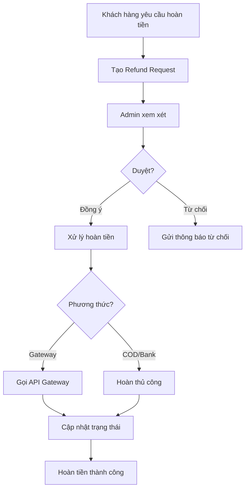

# Tính năng Thanh toán - Shop Gấu Bông

## Tổng quan

Hệ thống thanh toán toàn diện hỗ trợ nhiều phương thức thanh toán, tính toán chi tiết phí và quản lý hoàn tiền.

## Các tính năng chính

### 1. Phương thức thanh toán

#### 1.1. COD (Cash On Delivery)
- **Mô tả**: Thanh toán khi nhận hàng
- **Phí**: 2% giá trị đơn hàng
  - Phí tối thiểu: 10,000 VND
  - Phí tối đa: 50,000 VND
- **Luồng xử lý**:
  1. Khách hàng chọn COD khi đặt hàng
  2. Hệ thống tính phí COD
  3. Shipper thu tiền và xác nhận thanh toán

#### 1.2. Chuyển khoản ngân hàng
- **Mô tả**: Chuyển khoản trực tiếp
- **Phí**: Miễn phí
- **Luồng xử lý**:
  1. Khách hàng chọn chuyển khoản
  2. Hệ thống hiển thị thông tin tài khoản
  3. Khách hàng chuyển khoản và gửi ảnh xác nhận
  4. Admin xác nhận thanh toán

#### 1.3. VNPay Gateway
- **Mô tả**: Cổng thanh toán VNPay
- **Phí**: 2.2% giá trị giao dịch
- **Tính năng**:
  - Thanh toán qua QR Code
  - Thanh toán qua thẻ ATM/VISA/MasterCard
  - Hỗ trợ hoàn tiền tự động
- **Cấu hình**:
  ```java
  VNP_TMN_CODE = "YOUR_TMN_CODE"
  VNP_HASH_SECRET = "YOUR_HASH_SECRET"
  VNP_URL = "https://sandbox.vnpayment.vn/paymentv2/vpcpay.html"
  ```

#### 1.4. MoMo Wallet
- **Mô tả**: Ví điện tử MoMo
- **Phí**: 2.5% giá trị giao dịch
- **Tính năng**:
  - Thanh toán qua ví MoMo
  - Thanh toán qua QR Code
  - Hỗ trợ hoàn tiền tự động
- **Cấu hình**:
  ```java
  PARTNER_CODE = "YOUR_PARTNER_CODE"
  ACCESS_KEY = "YOUR_ACCESS_KEY"
  SECRET_KEY = "YOUR_SECRET_KEY"
  ```

#### 1.5. SePay Gateway
- **Mô tả**: Cổng thanh toán SePay
- **Phí**: 1.8% giá trị giao dịch
- **Tính năng**:
  - Thanh toán đa kênh
  - Phí thấp nhất
  - Hỗ trợ hoàn tiền
- **Cấu hình**:
  ```java
  MERCHANT_ID = "YOUR_MERCHANT_ID"
  SECRET_KEY = "YOUR_SECRET_KEY"
  ```

### 2. Tính toán chi tiết phí

#### 2.1. Các loại phí

| Loại phí | Mô tả | Áp dụng |
|----------|-------|---------|
| **Phí COD** | Phí thanh toán khi nhận hàng | COD |
| **Phí Gateway** | Phí cổng thanh toán | VNPay, MoMo, SePay |
| **Phí giao dịch** | Phí xử lý giao dịch | Tất cả |
| **Phí xử lý** | Phí xử lý đơn hàng | Tùy chọn |
| **Phí vận chuyển** | Phí giao hàng | Tất cả |
| **Thuế VAT** | Thuế giá trị gia tăng | Tùy chọn |

#### 2.2. Công thức tính tổng tiền

```
Tiền hàng (Subtotal) = Σ(Giá sản phẩm × Số lượng)
Phí COD = Max(Min(Tiền hàng × 2%, 50,000), 10,000)
Phí Gateway = Tiền hàng × Tỷ lệ phí gateway
Tổng phí = Phí COD + Phí Gateway + Phí giao dịch + Phí xử lý
Tổng cộng = Tiền hàng + Tổng phí + Phí ship + Thuế - Giảm giá
```

#### 2.3. Ví dụ tính phí

**Đơn hàng COD:**
```
Tiền hàng: 500,000 VND
Phí COD: 500,000 × 2% = 10,000 VND
Phí ship: 30,000 VND
Tổng cộng: 540,000 VND
```

**Đơn hàng VNPay:**
```
Tiền hàng: 1,000,000 VND
Phí Gateway: 1,000,000 × 2.2% = 22,000 VND
Phí ship: 30,000 VND
Tổng cộng: 1,052,000 VND
```

### 3. Quản lý hoàn tiền

#### 3.1. Điều kiện hoàn tiền

- Thanh toán đã hoàn tất
- Chưa hoàn hết số tiền
- Trong thời hạn hoàn tiền (thường 7-30 ngày)

#### 3.2. Quy trình hoàn tiền



#### 3.3. Phí hoàn tiền

- **Tỷ lệ**: 1% số tiền hoàn
- **Áp dụng**: Tất cả phương thức
- **Ví dụ**:
  ```
  Số tiền hoàn: 100,000 VND
  Phí hoàn: 100,000 × 1% = 1,000 VND
  Số tiền thực nhận: 99,000 VND
  ```

#### 3.4. Trạng thái hoàn tiền

| Trạng thái | Mô tả |
|------------|-------|
| **PENDING** | Chờ xử lý |
| **APPROVED** | Đã duyệt |
| **PROCESSING** | Đang xử lý |
| **COMPLETED** | Hoàn tiền thành công |
| **REJECTED** | Từ chối |
| **FAILED** | Thất bại |

## Cách sử dụng

### 1. Tạo thanh toán

```java
PaymentService paymentService = new PaymentService();

// Tạo request
PaymentRequest request = new PaymentRequest();
request.setOrderId(orderId);
request.setPaymentMethod(PaymentMethod.VNPAY);
request.setAmount(new BigDecimal("500000"));
request.setReturnUrl("http://yoursite.com/payment/return");
request.setIpAddress("192.168.1.1");

// Tạo thanh toán
PaymentResponse response = paymentService.createPayment(request);

if (response.isSuccess()) {
    // Redirect đến payment URL (cho gateway)
    String paymentUrl = response.getPaymentUrl();
    // hoặc hiển thị thông tin thanh toán (COD, Bank Transfer)
}
```

### 2. Tính phí

```java
PaymentService paymentService = new PaymentService();
Order order = orderDAO.findById(orderId).get();

// Tính phí cho từng phương thức
FeeCalculation codFee = paymentService.calculateFees(order, PaymentMethod.COD);
FeeCalculation vnpayFee = paymentService.calculateFees(order, PaymentMethod.VNPAY);
FeeCalculation momoFee = paymentService.calculateFees(order, PaymentMethod.MOMO);

// Hiển thị cho khách hàng chọn
System.out.println("COD: " + codFee.getGrandTotal());
System.out.println("VNPay: " + vnpayFee.getGrandTotal());
System.out.println("MoMo: " + momoFee.getGrandTotal());
```

### 3. Xử lý callback

```java
// Trong controller xử lý callback
Map<String, String> params = getCallbackParams();
PaymentResponse response = paymentService.processGatewayCallback(
    PaymentMethod.VNPAY, 
    params
);

if (response.isSuccess()) {
    // Thanh toán thành công
    // Cập nhật đơn hàng, gửi email, etc.
} else {
    // Thanh toán thất bại
}
```

### 4. Tạo yêu cầu hoàn tiền

```java
PaymentService paymentService = new PaymentService();

RefundRequest request = new RefundRequest();
request.setPaymentId(paymentId);
request.setAmount(new BigDecimal("100000"));
request.setReason("Sản phẩm bị lỗi");

Refund refund = paymentService.createRefundRequest(request);
```

### 5. Duyệt hoàn tiền

```java
PaymentService paymentService = new PaymentService();

// Duyệt
boolean approved = paymentService.approveRefund(refundId);

// Hoặc từ chối
boolean rejected = paymentService.rejectRefund(refundId, "Không đủ điều kiện");
```

## Database Schema

### Bảng payments

```sql
CREATE TABLE payments (
    id BIGINT PRIMARY KEY,
    order_id BIGINT NOT NULL,
    method VARCHAR(30) NOT NULL,
    status VARCHAR(30) NOT NULL,
    amount DECIMAL(15,2) NOT NULL,
    cod_fee DECIMAL(15,2) DEFAULT 0,
    gateway_fee DECIMAL(15,2) DEFAULT 0,
    transaction_fee DECIMAL(15,2) DEFAULT 0,
    processing_fee DECIMAL(15,2) DEFAULT 0,
    refunded_amount DECIMAL(15,2) DEFAULT 0,
    transaction_id VARCHAR(100),
    gateway_transaction_id VARCHAR(200),
    gateway_response_code VARCHAR(200),
    gateway_response TEXT,
    is_paid BOOLEAN DEFAULT FALSE,
    paid_at DATETIME,
    expired_at DATETIME,
    notes TEXT,
    ...
);
```

### Bảng refunds

```sql
CREATE TABLE refunds (
    id BIGINT PRIMARY KEY,
    payment_id BIGINT NOT NULL,
    refund_number VARCHAR(50) UNIQUE,
    amount DECIMAL(15,2) NOT NULL,
    refund_fee DECIMAL(15,2) DEFAULT 0,
    status VARCHAR(30) NOT NULL,
    reason TEXT NOT NULL,
    gateway_refund_id VARCHAR(200),
    approved_by VARCHAR(100),
    approved_at DATETIME,
    completed_at DATETIME,
    ...
);
```

## Cài đặt

### 1. Chạy migration

```bash
mysql -u username -p database_name < payment_migration.sql
```

### 2. Cấu hình gateway

Tạo file `payment.properties`:

```properties
# VNPay
vnpay.tmn.code=YOUR_TMN_CODE
vnpay.hash.secret=YOUR_HASH_SECRET
vnpay.url=https://sandbox.vnpayment.vn/paymentv2/vpcpay.html

# MoMo
momo.partner.code=YOUR_PARTNER_CODE
momo.access.key=YOUR_ACCESS_KEY
momo.secret.key=YOUR_SECRET_KEY
momo.url=https://test-payment.momo.vn/v2/gateway/api/create

# SePay
sepay.merchant.id=YOUR_MERCHANT_ID
sepay.secret.key=YOUR_SECRET_KEY
sepay.url=https://api.sepay.vn/payment/create
```

### 3. Thêm vào persistence.xml

Đảm bảo các entity mới được thêm:

```xml
<class>com.example.shopgaubong.entity.Refund</class>
```

## Testing

### Test tính phí

```java
@Test
void testFeeCalculation() {
    Order order = new Order();
    order.setSubtotal(new BigDecimal("500000"));
    
    FeeCalculation fee = paymentService.calculateFees(order, PaymentMethod.COD);
    
    assertEquals(new BigDecimal("10000"), fee.getCodFee());
    assertEquals(new BigDecimal("510000"), fee.getGrandTotal());
}
```

### Test hoàn tiền

```java
@Test
void testRefund() {
    Payment payment = createPaidPayment();
    
    RefundRequest request = new RefundRequest();
    request.setPaymentId(payment.getId());
    request.setAmount(new BigDecimal("100000"));
    request.setReason("Test");
    
    Refund refund = paymentService.createRefundRequest(request);
    assertNotNull(refund);
    assertEquals(RefundStatus.PENDING, refund.getStatus());
}
```

## Lưu ý quan trọng

1. **Bảo mật**:
   - Không commit các key/secret vào git
   - Sử dụng biến môi trường hoặc file config riêng
   - Verify tất cả callback từ gateway

2. **Xử lý lỗi**:
   - Log tất cả giao dịch
   - Xử lý timeout
   - Retry mechanism cho gateway

3. **Testing**:
   - Test với sandbox trước khi production
   - Test tất cả trường hợp: success, failed, timeout
   - Test hoàn tiền

4. **Monitoring**:
   - Monitor tỷ lệ thành công
   - Monitor thời gian xử lý
   - Alert khi có lỗi

## Support

Liên hệ team dev nếu có vấn đề:
- Email: dev@shopgaubong.com
- Slack: #payment-support

